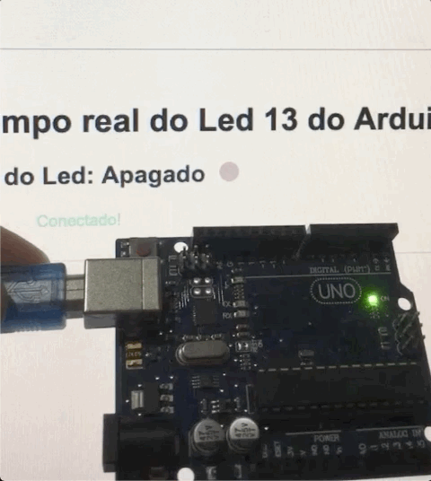
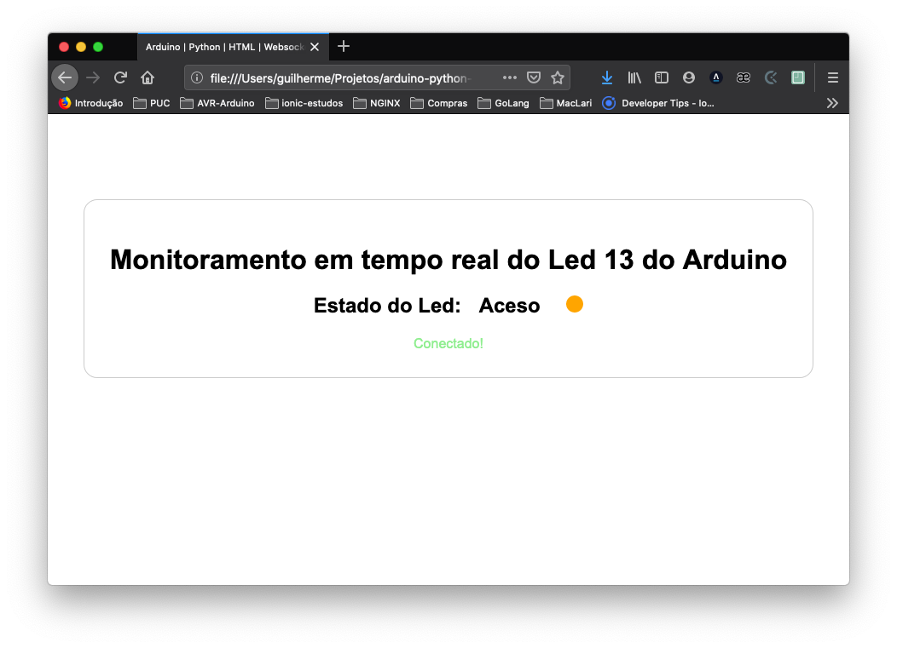
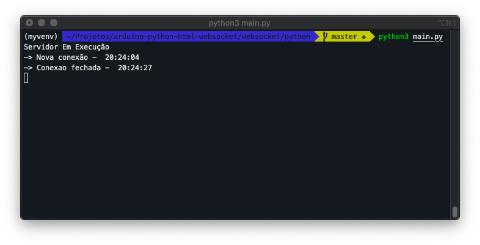

<h1 align="center">
  <br>
  <a></a>&nbsp;
  <a></a>&nbsp;
  <a></a>
  <br>
  ATmega328P , Arduino , Python , HTML , Websocker , Led13
  <br>
</h1>

<h2 align="center">Monitoramento do ATmega328P/Arduino via Página Web usando Websockets no Python 3</h2>

<p align="center">
    <a alt="ANSI C"></a>
    <a alt="Python 3"></a>
    <a alt="HTML 5"></a>
    <a alt="CSS 3"></a>
    <a alt="JQuery v3.4.1"></a>
    <a alt="License MIT"></a>
</p>

### Tabela de Conteúdo ###
1. [Sobre](#Sobre)
2. [Instruções](#Instruções)
3. [Fluxo da aplicação](#Fluxo-da-aplicação)
4. [Executando a aplicação](#Executando-a-aplicação)
5. [Capturas de tela | GIFs](#capturas-de-tela--gifs)
6. [Referências Consultadas](#referências-consultadas)
7. [Contributor](#Contributor)
8. [License](#License)


# Monitoramento do ATmega328P/Arduino via Página Web usando Websockets no Python 3

## Sobre 

Este repositório contém uma aplicação simples com o objetivo de demonstrar 
uma maneira de monitorar o estado do BIT 5 do regitro PORTB (PB5) do ATmega328P, LED 13 do Arduino UNO R3, via Página Web. 
O conceito pode ser extendido para outras aplicações similares.  

## Instruções 

O parte embarcada da aplicação foi escrita em  **ANSI C** usando a [PlatformIO IDE](https://platformio.org/) . 
Ela foi focada no Atmega328P presente no Arduino Uno R3, trabalhando diretamente com registradores do microcontrolador.  
Apesar de ultilizada o PlatformIO IDE, o codigo é portavel para o [Atmel Studio 7](https://www.microchip.com/mplab/avr-support/atmel-studio-7).

O Back-end da aplicação foi escrito em **Python (v3.7.3)**, e foram ultilizados os modulos 
[pySerial](https://pyserial.readthedocs.io/en/latest/shortintro.html) e 
[websockets](https://websockets.readthedocs.io/en/stable/intro.html) 
para leitura de dados na porta serial e comunicação websocket respectivamente.

O Frot-end da aplicação foi escrito em HTML e Javascript e a biblioteca [jQuery](https://jquery.com/) .  

### Fluxo da aplicação

O processo se inicia no ATmega328P, o firmware foi programado para alterar o estado do BIT 5 do regitro 
PORTB (PB5) a cada 1 segundo e logo em seguida imprimir na serial 1 byte contendo o estado do PB5. 
Este byte é transmitido em base 16 ( hexadecimal). O PB5 está conectado ao Pino 13 do arduino UNO R3 
como é descrito no site oficial do Arduino 
[PIN MAPPING ATmega328P - Arduino](https://www.arduino.cc/en/Hacking/PinMapping168) .  
Após o ATmega328P imprimir na serial o byte, o conversor serial do Arduino UNO transmite esse dado pelo USB.  
No computador, o algoritmo escrito em python fica lendo constatemente a porta serial USB onde 
o Arduino está conectado, quando há uma informação ou seja o byte, ele lê este byte que está em hexadecimal e converte 
para base 10 (decimal). Em seguida coloca esse numero que indica o estado do PB5 no formato JSON que utiliza 
texto legível a humanos, no formato **"atributo": valor** e transmite o JSON via websocket.  
A página web ao ser carregada pela primeira vez, estabelece a conexão via websocket com o servidor, e quando chega 
uma mensagem (informação/JSON) ela a lê e altera os elementos da página dinâmicamente seguindo os algoritmos 
escrito em javascript. 


### Executando a aplicação

1. Plugue o Arduino ao USB do carregador e carregue o código `src/main.c` para ATmega328P ultilizando o Platform IO IDE ou o Atmel Studio
2. Abra o terminal na pasta raiza da aplicação
3. Acesse a pasta do servidor em python `websocket/python`
```sh
cd websocket/python
```
4. Instale os modulos necessários para execução do servidor. (Se ultilizar for ultilizar Virtual Environment [Virtual Environments and Packages - Python Documentation](https://docs.python.org/3/tutorial/venv.html) , execute o procedimento '5.', caso contrário, ou seja ultilizar o python padrão do computador pule para o procedimento '7.')
5. Crie o ambiente virutal `myvenv`
```sh
python3 -m virtualenv myvenv
```
6. Ative o ambiente virtual `myvenv`
```sh
source ./myvenv/bin/activate
```
7. Instalação dos modulos necessários para execução do servidor usando o `pip` [Python PIP](https://pip.pypa.io/en/stable/installing/)
```sh
pip3 install -r requirements.txt
```
8. Inicie a execução do servidor (Não feche o terminal após iniciar o servidor)
```sh
python3 main.py
```
9. Abra a página web `websocket/html/index.html` em um navegador. Clique e Arraste o aquivo `index.html` para dentro do navegador que ele carregará a página. (O link será parecido com `file:///.../websocket/html/index.html`)
10. Após executar todos os procedimentos a aplicação estará em execução.
11. Para encerrar o servidor, abra o terminal que ele está em execução e pressione as teclase `Ctrl + C`, se a combinação de teclas não for bem sucedida, tente `Ctrl + Break` (Em alguns teclados a tecla `Break` é chamada de `Pause`)

### Capturas de tela | GIFs

#### Aplicacação





### Referências Consultadas

#### C
[The New C Standard An Economic and Cultural Commentary](http://www.coding-guidelines.com/cbook/cbook1_2.pdf)  
[ATmega328P DATASHEET](http://ww1.microchip.com/downloads/en/DeviceDoc/Atmel-7810-Automotive-Microcontrollers-ATmega328P_Datasheet.pdf)  

#### Python
[pySerial](https://pyserial.readthedocs.io/en/latest/shortintro.html)  
[websockets](https://websockets.readthedocs.io/en/stable/intro.html)  
[Python library Docs](https://docs.python.org/3/library/functions.html)  

#### HTML | CSS | JAVASCRIPT
[HTML | MDN](https://developer.mozilla.org/pt-BR/docs/Web/HTML)  
[CSS | MDN](https://developer.mozilla.org/pt-BR/docs/Web/CSS)  
[JavaScript | MDN](https://developer.mozilla.org/pt-BR/docs/Web/JavaScript)  
[W3Schools Online Web Tutorials](https://www.w3schools.com/)  
[JSON - JavaScript | MDN](https://developer.mozilla.org/pt-BR/docs/Aprender/JavaScript/Objetos/JSON)  
[jQuery](https://jquery.com/)  


### Contributor ###
[LinkedIn: Guilherme Rodrigues](https://www.linkedin.com/in/guilherme-r-54380b106/)

### License ###
This project is licensed under the terms of the MIT license.